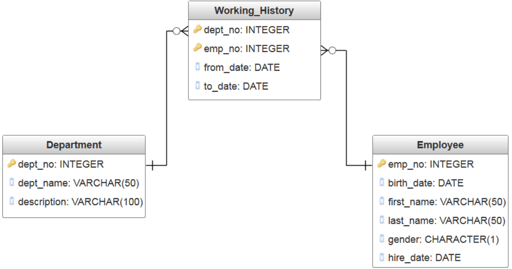

# Console employee management application

- OO design
- Mysql as dbms

ERD:

---

### Functions:

` Employee management`

1. Add a new Employee
2. Update a specific Employee
3. Find an employee by emp_no
4. Add the working history
5. Find all the employees by working period of time

`Department management`

1. Add a new department
